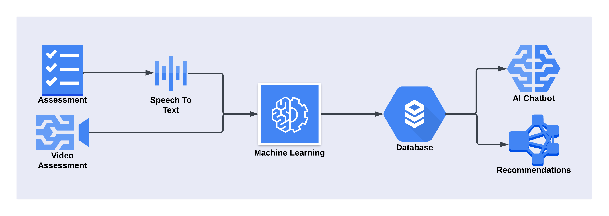
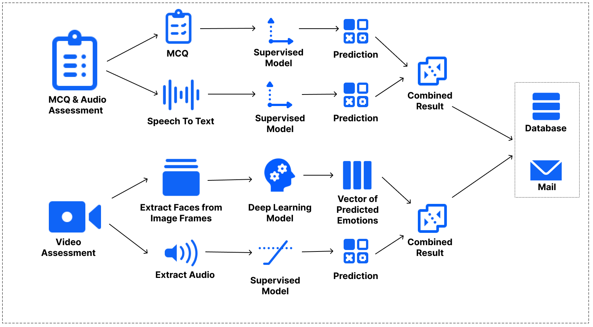
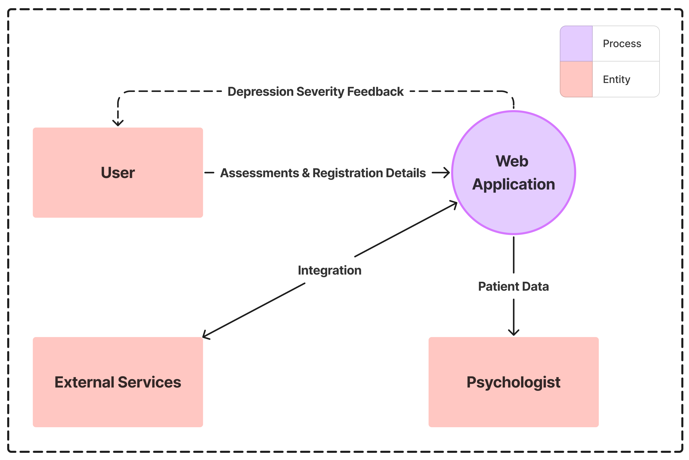
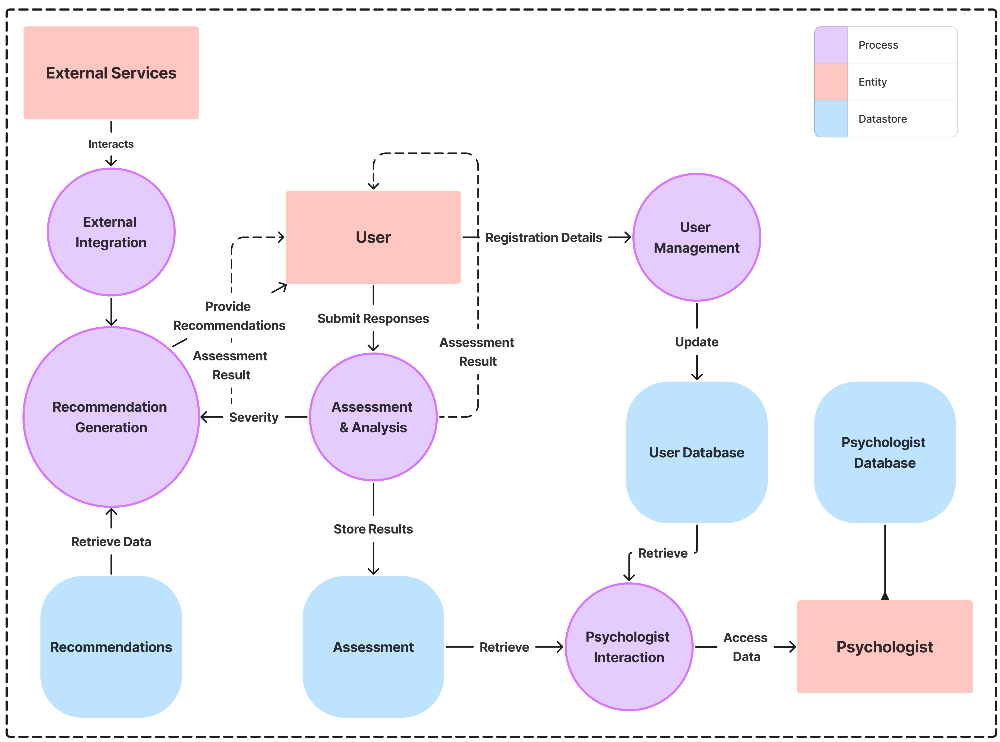
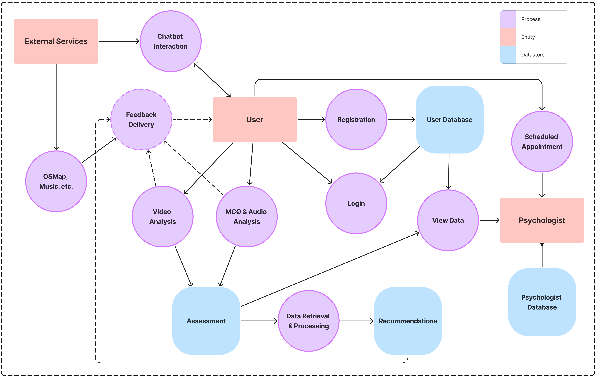
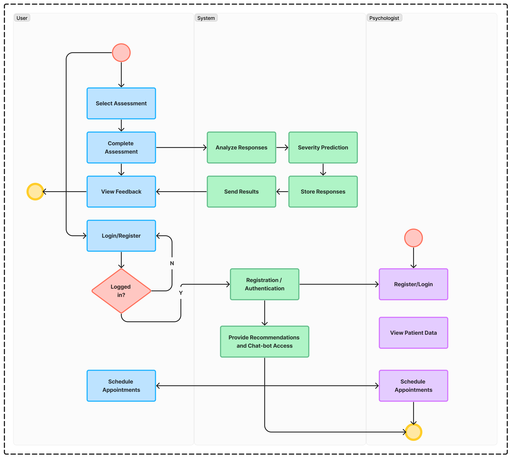
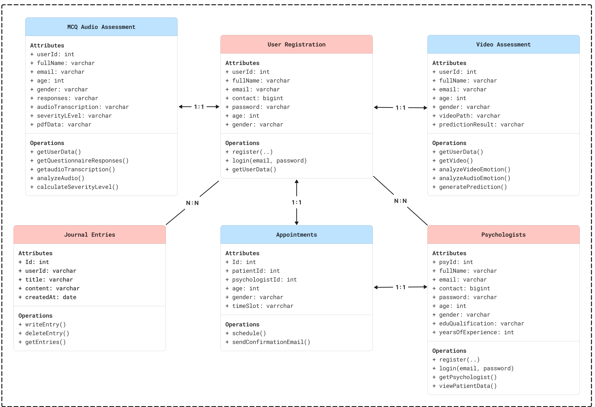
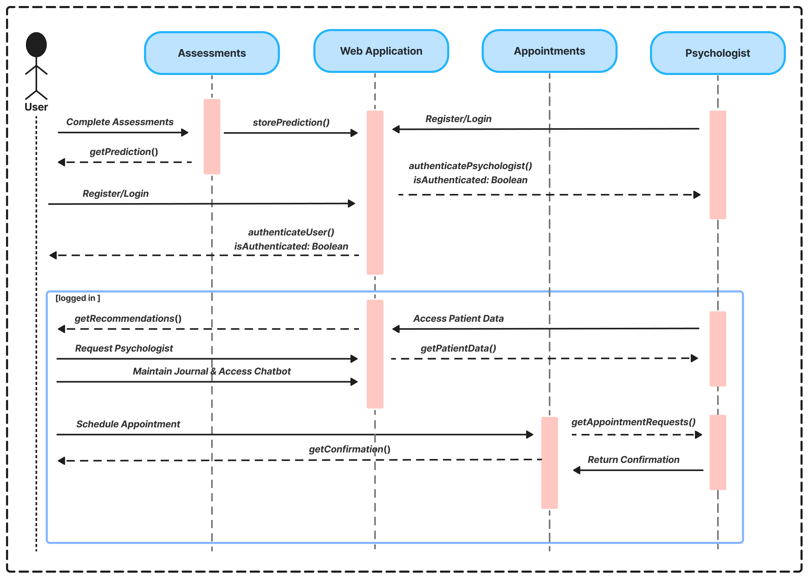
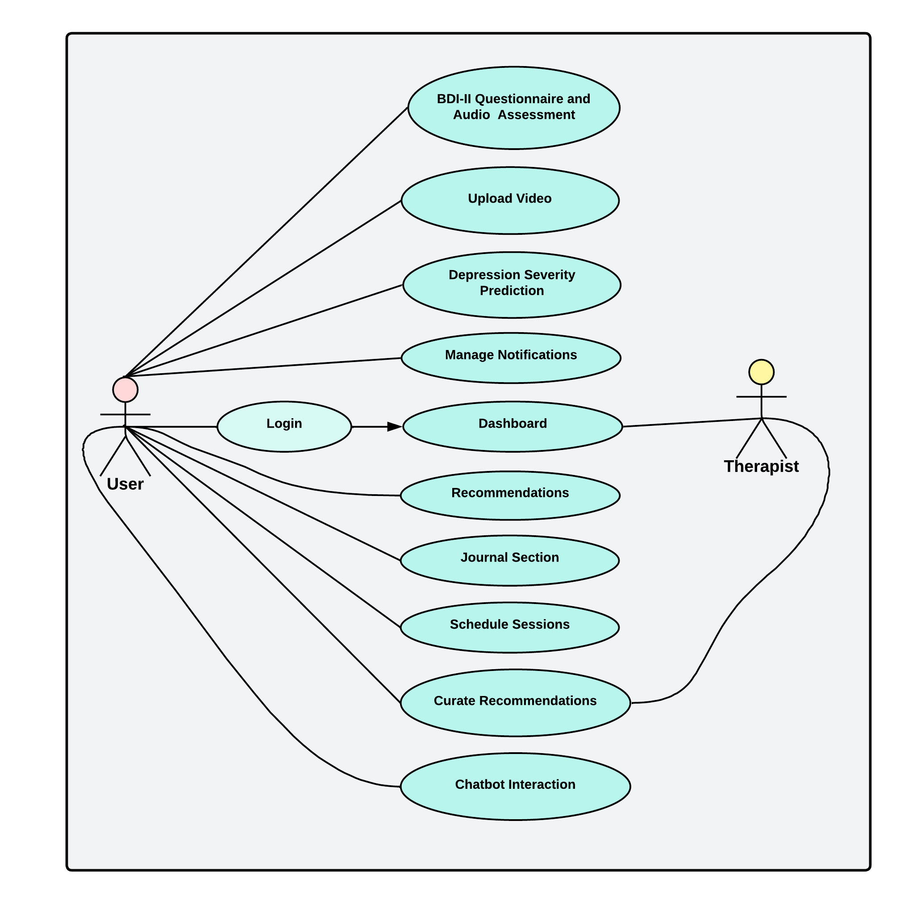
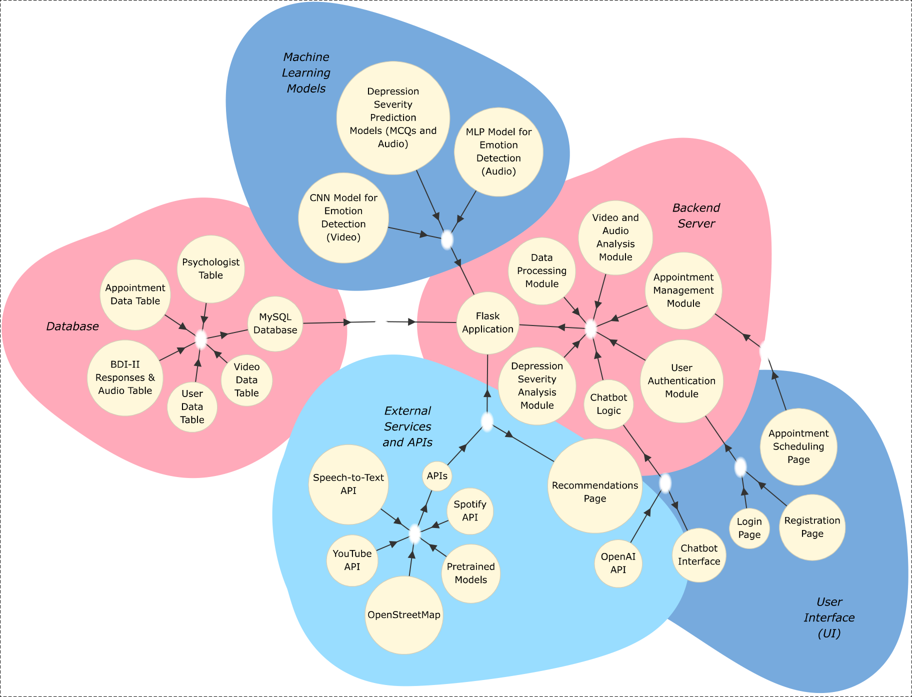

<!-- # 🧠 MindMend-->

### Personalized Mental Health Support, Recommendations & Professional Assistance

> A web application for depression severity detection and holistic mental health support,
> combining multi-modal machine learning with personalized psychiatrist-curated recommendations.

**📄 Research published at IEEE ICAIT 2024**
[View on IEEE Xplore →](https://ieeexplore.ieee.org/document/10690826)

---

## 📌 Overview

MindMend is a comprehensive mental health platform that assesses depression severity
through three complementary input modalities - structured questionnaire responses,
audio recordings, and video submissions and responds with personalized support
resources, professional access, and 24×7 AI-powered guidance.

The project was developed as a final-year B.E. (Computer Engineering) capstone at
**AISSMS Institute of Information Technology, Pune** (Savitribai Phule Pune University),
under the guidance of Ms. Shilpa P. Pimpalkar.

It was also presented at **Aavishkar 2023** - Maharashtra State Inter-University
Research Convention.

---

## 🔬 Research

**Title:** Advancements in Depression Severity Prediction: A Multi-Modal Machine
Learning Approach Integrating MCQs and Audio Data

**Conference:** 2024 Second International Conference on Advances in Information
Technology (ICAIT), Adichunchanagiri Institute of Technology, Karnataka
(July 24–27, 2024)

**Published:** IEEE Xplore - [DOI: 10.1109/ICAIT...10690826](https://ieeexplore.ieee.org/document/10690826)

> ⚠️ Source code is not publicly available in accordance with the IEEE publication.
> Please refer to the paper for complete methodology, mathematical models, and results.

---

## ✨ Features

### 🩺 Assessment
- **BDI-II MCQ Assessment** - 21-question Beck Depression Inventory-II questionnaire
  with simultaneous audio recording upload
- **Video Assessment** - Upload a video; system analyzes both facial expressions
  and extracted audio independently
- **Email Delivery** - Severity prediction and a personalized motivational message
  sent directly to the user's inbox

### 📊 Predictions
- Depression severity classified as: **Minimal · Mild · Moderate · Severe**
- MCQ model + Audio model predictions fused via weighted average
- Video model: CNN-based facial emotion recognition + audio emotion analysis,
  combined for a holistic result

### 🌿 Personalized Support (post-login)
- **Motivational Stories** - Psychiatrist-curated narrative content
- **Personal Journal** - Private space for daily reflections
- **Music Recommendations** - Spotify-integrated mood-based playlists
- **SparkTalks** - YouTube mental health video recommendations
- **Nearby Psychologists** - OpenStreetMap-based location display
- **AI Chatbot** - 24×7 OpenAI-powered mental health assistant
- **Appointment Scheduling** - Book sessions with psychologists;
  email confirmation sent automatically

### 🔐 Dual Portal
- **User portal** - Registration, login, full feature access
- **Psychologist portal** - View patient MCQ responses, audio transcriptions,
  video submissions, severity predictions, and manage appointments

---

## 🏗️ System Architecture

The core pipeline:

---

## 🧮 ML Models & Algorithms

### For MCQ + Audio (Regression)

| Model | MCQ MSE | Audio MSE |
|---|---|---|
| Linear Regression | 0.0944 | 0.2923 |
| Decision Tree | 0.1900 | 0.3349 |
| Random Forest | 0.1100 | ~0.2518 |
| Support Vector Regression | 0.0952 | ~0.3269 |

Final prediction = weighted average of MCQ model + Audio model outputs.

### For MCQ + Audio (Classification)

| Model | Accuracy | F1-Score |
|---|---|---|
| Logistic Regression | 0.82 | 0.81 |
| Decision Tree | 0.70 | 0.70 |
| Random Forest | 0.72 | 0.61 |
| Support Vector Classification | 0.72 | 0.61 |

**Logistic Regression** emerged as the preferred classifier - best balance of
accuracy, interpretability, and computational efficiency.

### For Video (Deep Learning)
- **CNN** trained on **FER2013** dataset for facial emotion recognition
- **Wav2Vec2ForCTC** transformer for audio transcription from video
- **SVM** for audio emotion classification (RAVDESS dataset)
- Results combined to produce a final video-based prediction

---

## 🛠️ Tech Stack

| Layer | Technology |
|---|---|
| Backend | Python 3.x, Flask |
| Database | MySQL |
| ML / DL | TensorFlow, Scikit-learn, Keras |
| Audio Processing | Librosa, Wav2Vec2ForCTC (HuggingFace) |
| Video Processing | OpenCV, MoviePy |
| NLP / Chatbot | OpenAI API |
| External APIs | Spotify API, YouTube Data API, OpenStreetMap API |
| Email | Flask-Mail (SMTP) |
| Frontend | HTML, CSS, JavaScript |

---
<!--
## 📸 Screenshots

### Landing Page

### BDI-II MCQ Assessment

### Video Assessment

### Assessment Result - Email

### User Home (Post-Login)

### Motivational Stories

### Personal Journal

### Music Recommendations

### Nearby Psychologists

### AI Chatbot

### Appointment Scheduling

### Model Accuracy Comparison

-->
---

## 📐 System Design Diagrams

Click to expand

### Data Flow - Level 0

### Data Flow - Level 1

### Data Flow - Level 2

### Activity Diagram

### Class Diagram

### Sequence Diagram

### Use Case Diagram

### SOCME

---

## 📋 BDI-II Scale Reference

| Score | Severity |
|---|---|
| 0 – 13 | Minimal depression |
| 14 – 19 | Mild depression |
| 20 – 28 | Moderate depression |
| 29 – 63 | Severe depression |

---

## ⚠️ Disclaimer

MindMend is an academic research prototype and is **not a substitute for professional
psychiatric evaluation or treatment**. If you or someone you know is in distress,
please contact a qualified mental health professional or a crisis helpline immediately.

**India helplines:**
- iCall: 9152987821
- NIMHANS: 080-46110007
- Vandrevala Foundation: 1860-2662-345 (24×7)

---

## 🏛️ Institution

**AISSMS Institute of Information Technology**
Department of Computer Engineering
Kennedy Road, Near R.T.O., Pune – 411001
Savitribai Phule Pune University | 2023–24

---

## 📎 SDG Alignment

This project addresses **UN Sustainable Development Goal 3 - Good Health and Well-Being**
by making mental health assessment accessible, technology-driven, and stigma-reducing.

---

*Research published · Built with purpose*

